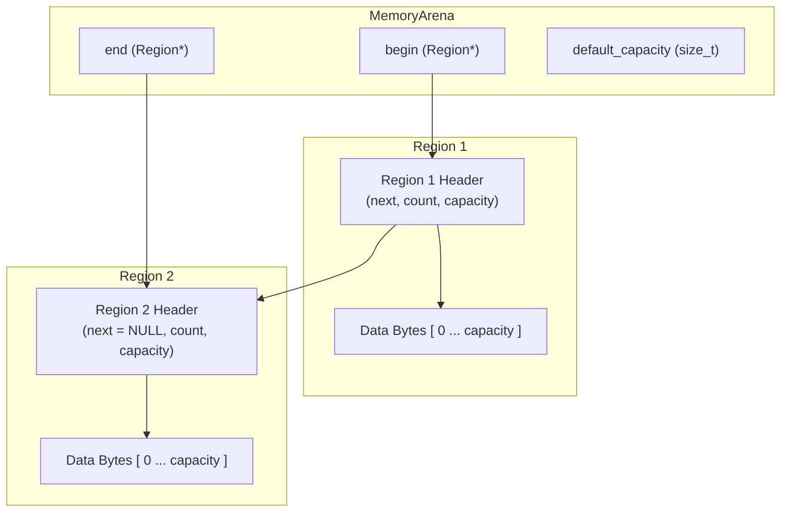

# Doodle Engine — Memory & Performance Guide

This document details the memory management architecture and performance optimizations implemented in the Doodle Engine. It covers custom memory arenas, DOM structure optimizations, asset caching, fast math lookup tables, and developer guidelines for maximizing performance.

---

## 1. Custom Memory Arena (`arena.h`)

Doodle bypasses the overhead of frequent system-level `malloc`/`free` calls by utilizing a custom, high-performance **Memory Arena**. 

### Architecture

The arena consists of a linked list of memory blocks called **Regions**. Each region contains a header and a flexible byte array for allocations.



### Key Features & API
- **Dynamic Growth**: When a region runs out of space, the arena automatically allocates a new region of `default_capacity` (or larger if the requested size exceeds the default capacity) and appends it to the linked list.
- **Alignment Handling**: Memory is automatically aligned to power-of-two boundaries (defaulting to `sizeof(uintptr_t)`) to prevent CPU alignment faults.
- **In-Place Reallocation**: `ArenaRealloc` checks if the block being reallocated was the most recent allocation in that region. If so, it expands the block in-place, avoiding copy overhead.
- **Snapshots & Rewinding**: Developers can take a snapshot of the arena's state using `ArenaGetMarker` and rewind the arena back to that state using `ArenaRewind`. This is extremely fast (O(1)) and resets counts without freeing the regions.
- **Trimming**: Calling `ArenaTrim` frees any trailing, unused regions that were invalidated by a rewind operation.
- **Arena Formatting**: `ArenaSprintf` and `ArenaVPrintf` allow formatting strings directly into the arena, preventing temporary heap allocations.
- **Dynamic Array Macros**: `arena_da_append` and `arena_da_resize` provide automatic, arena-backed growth for dynamic structures.

---

## 2. DOM Arena & UINode Memory Compression

To render complex interfaces efficiently, Doodle optimizes how the layout tree is stored in memory.

### The Centralized `dom_arena`
All elements parsed from `layout.html` and their styled properties are allocated in a dedicated, static `dom_arena`.
- In Doodle v1.2.0, the `dom_arena` size was optimized and reduced from **2.0 MB to 512 KB**, saving 1.5 MB of static layout overhead.

### 90% Struct Memory Reduction
Originally, the `UINode` and `StyleProps` structures contained fixed-size character arrays for ID, class names, asset paths, and text content (e.g., `char id[64]`, `char text_content[512]`). This meant every single node consumed over 1.4 KB, even if it had no text or class names.

In the current version, `UINode` is compressed to **~220 bytes (a 90% reduction)** by using pooled string pointers:

```c
// Compressed UINode String Fields
typedef struct UINode {
    const char* id;            // Pointing to pooled memory in dom_arena
    const char* class_name;    // Pointing to pooled memory in dom_arena
    const char* text_content;  // Pointing to pooled memory in dom_arena
    const char* asset_path;    // Pointing to pooled memory in dom_arena
    // ...
} UINode;
```

When the HTML/CSS parsers read strings, they allocate them using `DOMStrDup(const char*)` which copies the string once into the `dom_arena` and returns a read-only pointer. This eliminates empty-buffer padding inside node structs.

---

## 3. Dynamic Hash Caches (`cache.c`)

Doodle caches GPU textures, TTF fonts, compiled GLSL shaders, and audio files to prevent redundant and slow disk reads.

### Arena-Backed Hash Tables
Earlier versions of Doodle used fixed-size arrays for caches, which could overflow or fragment. The asset caching system now uses **dynamic hash tables** backed by a shared memory arena:
- **O(1) Access**: Assets are hashed using the FNV-1a string hashing algorithm for constant-time lookup.
- **Shared Memory**: Cache allocations are pooled in a single arena. Closing the window frees the entire arena in a single call, preventing resource leaks.

### Automatic Runtime Shader Reloading
Custom shaders are monitored by the cache manager's `CheckShaderUpdates` function. Each frame, it checks the modification timestamp of active `.fs` files. If a shader file is edited and saved on disk, it is automatically recompiled and hot-swapped in the GPU cache without restarting the application.

---

## 4. Rendering & Math Optimizations

### FBO Camera Bypass
When using the 2D camera viewport (`<view camera="true">`), traditional renderers draw the camera world to a Framebuffer Object (FBO) render-texture, then apply shaders, and blit it to the backbuffer.

Doodle implements an **FBO Bypass Optimization**:
- If `camera="true"` is active but **no custom shader** is specified in the CSS properties, the renderer bypasses render-texture creation, bindings, and blitting.
- Instead, it configures Raylib's native 2D camera offsets and renders the UI layout directly to the window backbuffer, eliminating render-to-texture overhead.

### Trigonometry Lookup Table (LUT) (`fast_math.h`)
Standard trigonometry functions (`sinf`/`cosf`) are computationally heavy when called thousands of times per frame (e.g., in audio synthesis or particle bursts).

Doodle uses a precalculated 360-degree lookup table:
- **`fast_sin(float angle)` & `fast_cos(float angle)`** map angles directly to pre-computed float values in the LUT.
- This reduces trigonometry latency to a simple array lookup, improving particle updates and synth sample generation.

### Particle Pool Limits
To maintain a tight memory footprint, the maximum pre-allocated particle limit was reduced from **2,048 to 512**. This saves static memory while providing enough visual feedback for retro gameplay effects.

---

## 5. Developer Guidelines for High Performance

To ensure your Doodle applications run at a stable 60 FPS:

### 1. Batch State Updates (`doodle.batchProcess`)
Every crossing from the Python interpreter to the C core has overhead. If you are updating positions or checking collisions for many entities, **do not** call individual setters in a loop. Use `doodle.batchProcess()` instead:

```python
# AVOID THIS in tick():
for brick in bricks:
    if doodle.checkCollision("ball", brick.id):
        bounce()

# DO THIS instead:
results = doodle.batchProcess(
    positions={"ball": (bx, by)},
    collisions=[("ball", brick.id) for brick in bricks]
)
```

### 2. Avoid Shaders on High-Frequency View Nodes
Applying a custom GLSL shader forces the engine to use an FBO render-texture. Keep shader applications restricted to container views (like `#game-area` or `#screen`) rather than many individual small nodes.

### 3. Use Relative/Percentage Layouts Wisely
The Flexbox solver only recomputes layout when a node is marked dirty (via position, text, or visibility changes). If you have static UI elements, keep them separate from game entities to minimize the size of the layout tree that needs to be refiltered.
